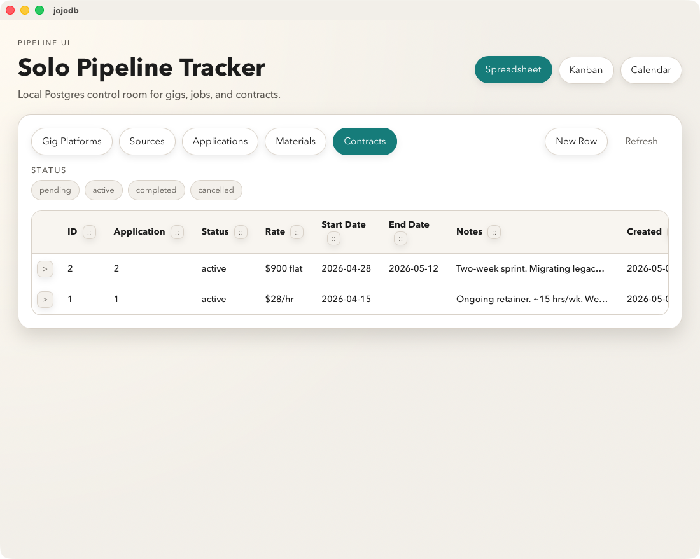
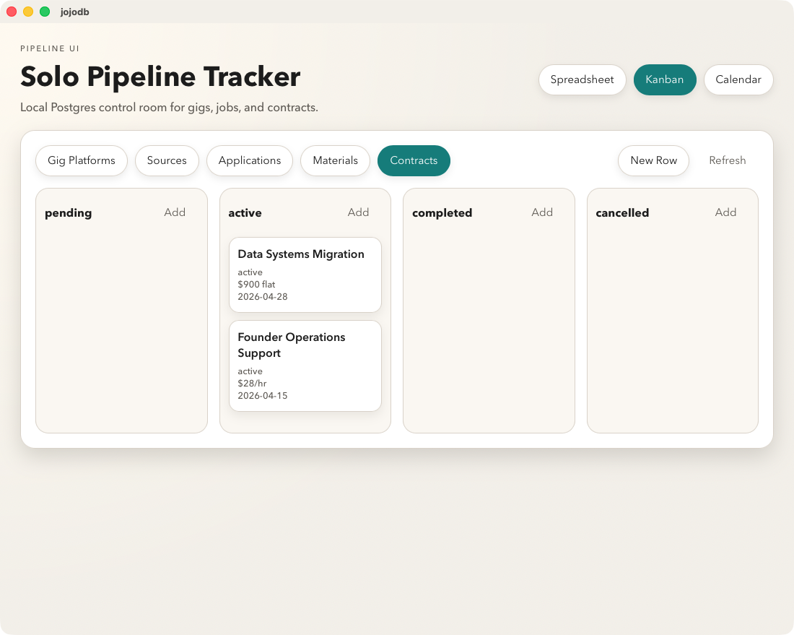
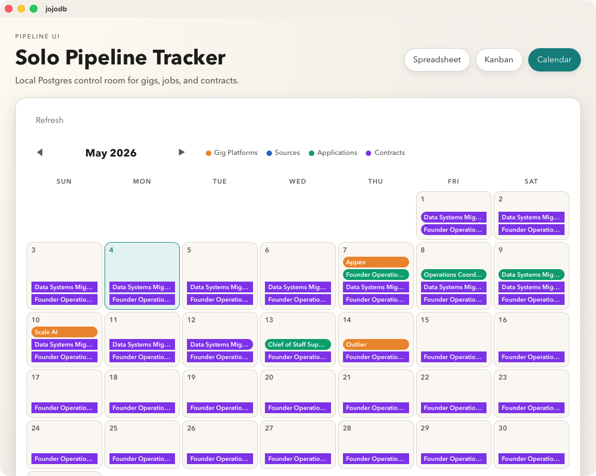

# jojodb — Job Search Pipeline Manager

A local-first desktop app for managing a three-track job search: gig platforms, direct applications, and contracting platforms. Built with Tauri, React, TypeScript, and a Rust/Postgres backend — no cloud, no auth, no external services.

---

## Why This Exists

Job search tracking tools are either too simple (spreadsheets with no structure) or too complex (cloud-synced SaaS with subscription gates). This app sits in the middle: a proper relational schema with enum-driven status fields, inline editing, and multiple views — all running entirely on your own machine.

---

## Screenshots

**Spreadsheet view** — sortable columns, inline editing, binary enum filters, persistent column reorder



**Kanban view** — drag cards between status columns, add and edit from the board



**Calendar view** — next actions across all tracks, color-coded by table



---

## Stack

| Layer | Technology |
|---|---|
| Desktop shell | [Tauri v2](https://tauri.app) (Rust) |
| Frontend | React 19 + TypeScript |
| Build tool | Vite |
| Database | PostgreSQL (local, via [Postgres.app](https://postgresapp.com)) |
| DB driver | `tokio-postgres` (Rust, async) |
| Schema management | Raw SQL migrations (Rails-style versioning) |

---

## Features

- **Spreadsheet view** — sortable columns, binary enum filters, inline row editing, column reorder (persisted locally)
- **Kanban view** — drag cards between status columns, add/edit from the board
- **Calendar view** — next actions across all tracks, color-coded by source table
- **Three tracks** in one app: gig platforms, job applications, contracting platforms
- **Offline-safe** — clear "Database offline" banner if Postgres isn't running; no crashes
- **No ORM** — raw SQL queries via a Tauri command proxy; schema stays transparent

---

## Getting Started

### Prerequisites

- [Rust](https://rustup.rs) (stable)
- [Node.js](https://nodejs.org) 18+
- [Postgres.app](https://postgresapp.com) running locally
- A `pipeline` database with migrations applied

### Setup

```bash
# Install Node dependencies
npm install

# Apply schema migrations from your database project directory
./migrate.sh

# Start the app in development mode
npm run tauri dev
```

First run compiles the Rust/Tauri runtime — expect 10–15 minutes. Subsequent runs are fast.

### Database connection

The app expects a local Postgres database. Update the connection string in `src-tauri/src/lib.rs` to match your local database name and credentials before running.

---

## Project Structure

```
jojodb/
├── src/
│   ├── App.tsx           # Main UI — spreadsheet and kanban views
│   ├── App.css           # Styles
│   └── lib/
│       ├── schema.ts     # Table/column config, ENUM definitions
│       └── db.ts         # Tauri invoke wrappers for db_query / db_execute
└── src-tauri/
    └── src/
        ├── lib.rs        # Rust Tauri commands: db_query, db_execute
        └── main.rs       # Entry point
```

---

## Architecture Notes

The Rust layer is intentionally thin — it opens a Postgres connection, runs the query as provided, and returns JSON. All business logic and query construction lives in TypeScript. This keeps the Rust code auditable in under 60 lines and avoids ORM abstraction overhead.

`simple_query` is used for SELECT statements (returns rows as string maps). `execute` is used for INSERT/UPDATE/DELETE (returns affected row count). Both are exposed as Tauri commands and called from the React frontend via `invoke()`.

---

## Status

Active development. Spreadsheet, kanban, and calendar views are functional. Test coverage is in progress.
